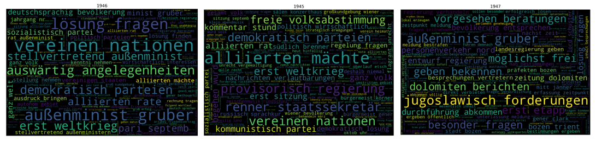

# Discover a newspaper collection with diachronic Ngram clouds

Ngrams are connected sequences of n items from a given text or speech sample. This means that words are not considered as individual units, but in relation to each other. For scholars in the humanities, ngrams can be helpful to get an overview of their collection or to identify discourse markers (discourse = a group of related texts belonging to a common system of formation). Ngrams can never be a research result per se - which is true for any output of NLP methods - but they can help to find important patterns in a particular collection.  

If ngrams are used to identify discourse markers, it can be useful to create diachrinic ngrams to explore the change of rextual patterns. This Notebook therefore shows how diachronic ngrams can be build and visualized. For cultural heritage material, visualizations should make it possible to open up and experience the collections in new ways. But they should always be linked to the original documents. 

The graphic representation and the original material cannot be perceived as two different elements, they are rather  interwoven and interact with each other. Therefore, this Notebook allows to browse the original texts within the Notebook. Thus the results of the ngram clouds can be researched in the context of the original text. 
